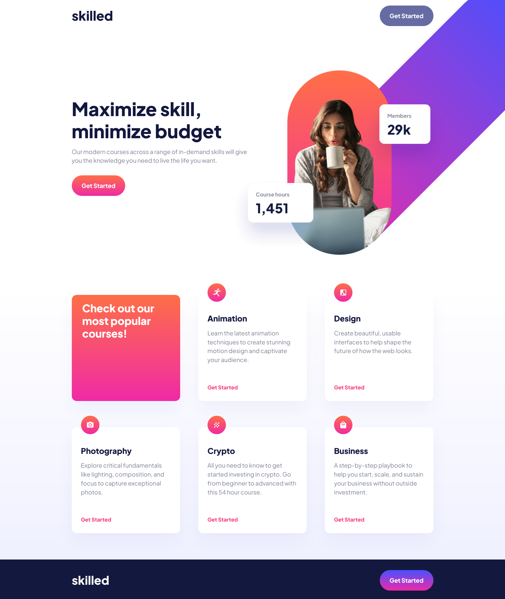

# Frontend Mentor - Skilled e-learning landing page solution

This is a solution to the [Skilled e-learning landing page challenge on Frontend Mentor](https://www.frontendmentor.io/challenges/skilled-elearning-landing-page-S1ObDrZ8q). Frontend Mentor challenges help you improve your coding skills by building realistic projects.

## Table of contents

- [Overview](#overview)
  - [The challenge](#the-challenge)
  - [Screenshot](#screenshot)
  - [Links](#links)
- [My process](#my-process)
  - [Built with](#built-with)
  - [What I learned](#what-i-learned)
  - [Continued development](#continued-development)
  - [Useful resources](#useful-resources)
- [Author](#author)


## Overview

### The challenge

Users should be able to:

- View the optimal layout depending on their device's screen size
- See hover states for interactive elements

### Screenshot



### Links

- Solution URL: [https://github.com/patriciadiasdesousa/e-learning-landing-page]
- Live Site URL: [https://raw.githack.com/patriciadiasdesousa/e-learning-landing-page/master/index.html]

## My process

### Built with

- Semantic HTML5 markup
- Flexbox
- Combination of SMACSS and BEM CSS architecture

### What I learned

- How to use a CSS architecture framework to organize styles in a way that is flexible but easy to reference. I adapted the SMACSS architecture to my project by creating a specific section for RESET and TYPOGRAPHY Rules.

```css

/* Site Stylesheet
  1. RESET
  2. BASE
  3. LAYOUT
  4. TYPOGRAPHY
  5. MODULE
  6. STATE
  */
  
}
```
- How to adapt BEM methodology naming rules with SMACSS achitecture.

- How to plan the website structure using semantic HTML

### Continued development

- Continue to test BEM and SMACSS together to see how well it adapts with more complex layouts.

### Useful resources

- [https://css-tricks.com/wp-content/uploads/2022/02/css-flexbox-poster.png] I printed this cheatsheet to hreference some CSS Flexbox properties

## Author

- Medium - [@patriciadiasdesousa](https://medium.com/@patriciadiasdesousa)
- Frontend Mentor - [@patriciadiasdesousa](https://www.frontendmentor.io/profile/patriciadiasdesousa)
- GitHub [@patriciadiasdesousa](https://github.com/patriciadiasdesousa)
